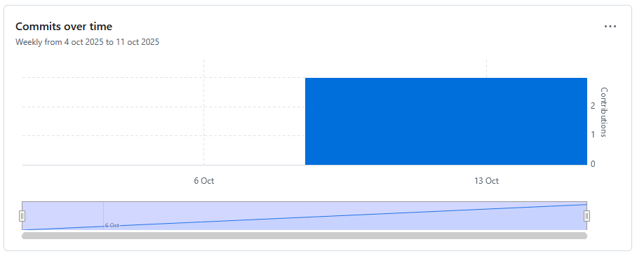

# Posgrado Estadística 2025
## MCF: Experimentación y Métodos Estadísticos

### Introducción
Este repositorio documenta los tres laboratorios realizados durante el curso de estadística, como parte del programa de posgrado en ciencias forestales. Su objetivo es evidenciar el proceso de aprendizaje, la aplicación de herramientas estadísticas en R y la organización del trabajo académico mediante buenas prácticas de documentación.

### Actividades realizadas

- Laboratorio 1 (`Lab_01.html`): Introducción a R y RStudio. Primer contacto con la consola, creación de variables, uso de funciones básicas y clasificación de variables estadísticas.
- Laboratorio 2 (`Lab_02.html`): Contraste de medias con la base de datos Iris. Aplicación de prueba t para comparar especies, visualización de datos y cálculo del tamaño del efecto.
- Laboratorio 3 (`Lab_03.pdf`): Análisis de varianza (ANOVA) para comparar concentraciones de estroncio en cuerpos de agua. Aplicación de pruebas post-hoc (LSD y Tukey HSD) e interpretación ambiental.

### Estructura del repositorio

- `Laboratorios/`: Archivos de los tres laboratorios realizados.
  - `Lab_01.html`
  - `Lab_02.html`
  - `Lab_03.pdf`

Los archivos están ordenados por número para facilitar la revisión y trazabilidad del trabajo.

### Contribuciones

La gráfica de contribuciones muestra la actividad en el repositorio, reflejando el trabajo progresivo y constante durante el curso.

### Objetivo del repositorio

Este repositorio busca consolidar los productos de aprendizaje del curso, fomentar la reproducibilidad científica y servir como portafolio académico para futuras oportunidades profesionales.
